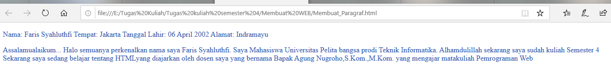
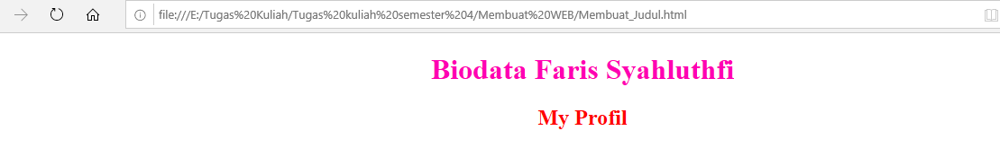
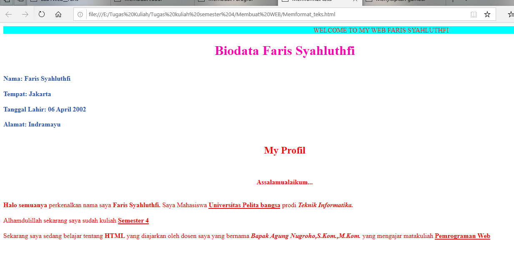

# Lab1web

| Nama= Faris Syahluthfi      | 
|-----------------------------|
| NIM= 312010034              |
|=============================| 
| Kelas= TI.20.A.1            |
|-----------------------------|
| Matkul= Pemrograman Web     |
|=============================|

## 1. Membuat Paragraf


Ini adalah sebuah hasil dari texs Kodingan tag membuat paragraf<p>
 Dan Ini Adalah program codingan dari tag membuat paragraf:

```html
<!DOCTYPE html >
<HTMl>
    <head>
        <title>Membuat Paragraf</title>
    <style>
body {

    color: red;
}
h1 {
	color: #ff00b3;
}
p {
	color: rgb(36, 85, 177)
}

    </style>
    </head>
    <body>
<!-- Ini adalah paragraf kesatu -->
<p align=”justify,”>
    Nama: Faris Syahluthfi
    Tempat: Jakarta
    Tanggal Lahir: 06 April 2002
    Alamat: Indramayu
    </p>

    <!-- Ini adalah paragraf kedua -->
    <p align=left,”>
        Assalamualaikum...
        Halo semuanya perkenalkan nama saya Faris Syahluthfi. Saya Mahasiswa Universitas Pelita bangsa prodi Teknik Informatika.
        Alhamdulillah sekarang saya sudah kuliah Semester 4
        Sekarang saya sedang belajar tentang HTMLyang diajarkan oleh dosen saya yang bernama Bapak Agung Nugroho,S.Kom.,M.Kom.
        yang mengajar matakuliah Pemrograman Web </p>


    </body>
    
</HTMl>
```

## 2. Membuat Judul


Ini adalah sebuah hasil dari texs Kodingan tag membuat paragraf<p>
 Dan Ini Adalah program codingan dari tag membuat paragraf:

 ```html

<!DOCTYPE html >
<HTMl>
    <head>
        <title>Membuat Judul</title>
    <style>
body {

    color: red;
}
h1 {
	color: #ff00b3;
}
p {
	color: rgb(36, 85, 177)
}

    </style>
    </head>
    <body>
<!-- judul paragraf pertama -->
<h1><center>Biodata Faris Syahluthfi</center></h1>


<!-- judul paragraf kedua -->
<h2><center>My Profil</center></h2>

</body>
    
</HTMl>
 ```


## Memformat teks


Ini adalah Contoh dari Teks format seperti Menambahkan (Span) Untuk Warna Teks atau sebuah background
## Contoh Kode
```Html
<!DOCTYPE html >
<HTMl>
    <head>
        <title>Memformat teks</title>
    <style>
body {

    color: red;
}
h1 {
	color: #ff00b3;
}
p {
	color: rgb(36, 85, 177)
}

    </style>
    </head>
    <body>

        <marquee bgcolor="cyan" width="1500">WELCOME TO MY WEB FARIS SYAHLUTHFI</marquee>

    <!-- Ini adalah paragraf kesatu -->
    <h1><center>Biodata Faris Syahluthfi</center></h1>
        <p align=”justify,”>
            <br><b>Nama: Faris Syahluthfi</b></br>
            <br><b>Tempat: Jakarta</b></br>
            <br><b>Tanggal Lahir: 06 April 2002</b></br>
            <br><b>Alamat: Indramayu</b></br>
            <br> 
        </p>
        
    <!-- Ini adalah paragraf kedua -->
    <h2><center>My Profil</center></h2>
     </p>   
    <p align=left,”>
            <br><center><b>Assalamualaikum...</b></center></br>
            <br><b>Halo semuanya</b> perkenalkan nama saya <b>Faris Syahluthfi.</b>
            Saya Mahasiswa <b><u>Universitas Pelita bangsa</u></b> prodi <i><b>Teknik Informatika.</b></i> </br>
            <br>Alhamdulillah sekarang saya sudah kuliah <b><u>Semester 4</u></b> </br>
            <br>Sekarang saya sedang belajar tentang <b>HTML</b> yang diajarkan oleh dosen saya yang bernama <b><i>Bapak Agung Nugroho,S.Kom.,M.Kom.</i></i></b>
            yang mengajar matakuliah <b><u>Pemrograman Web</u></b></p> <br>

        </p>


    </body>
    
</HTMl>


<!-- Menambahkkan link Navigasi  -->
<nav>
<a href="tag_Dasar.html">Dasar html </a>
<a href="halaman2.html">halaman2</a>
<a href="https://github.com/MuhammadRifaiAditiya/Lab1Web">halaman web ekternal google</a>
<hr>
</nav>
<!-- Judul Paragraf Pertama -->
<h1>Belajar Dasar Html</h1>
<!-- Paragraf Pertama -->
<p align="center">Saya Adalah  <Span style="background-color: red;">Mahsiswa Universitas Pelita Bangsa Jurisan
    Teknik Informatika </Span> 
<!-- Judul Paragraf kedua -->
<h2>Paragraf Pada Html</h2>
<!-- Paragraf Kedua -->
<p align="right">Html Sendiri Adalah <b>Struktur</b>  atau kerangka dalam <u>membuat website</u> 
     yang terdiri anak head dan <i>tag penutup html </i></p>                                                        
<!-- Sub Judul Paragraf -->
<h3>Menambahkan Gambar</h3>   
<!-- Menambahkan gambar pada Paragraf -->


</body>
</html>


```